# JFF Revision 1.1 JoyFix Board

This is an interposer board that fixes the existing bug in the joystick circuit of the [Just For Fun (JFF) computer revision 1.1](https://github.com/konkotgit/JFF) by @skoti.

See the [Omega 1.4 Joyfix Board](https://github.com/herraa1/omega-1.4-joyfix-board-v1) for information on a similar (but not the same) bug affecting the [Omega Home Computer mainboard revision 1.4](https://github.com/skiselev/omega) by Sergey Kiselev.

# The standard MSX joystick circuit

Please, refer to the [details about the standard MSX joystick circuit](https://github.com/herraa1/omega-1.4-joyfix-board-v1?tab=readme-ov-file#the-standard-msx-joystick-circuit) in the [Omega 1.4 Joyfix Board](https://github.com/herraa1/omega-1.4-joyfix-board-v1).

Focusing on the relevant information, output trigger signals must be connected via open-collector buffers like this:
- :white_check_mark: the output at the open-collector buffer corresponding to signal IOB0 is connected to joystick port 1 trigger A
- :white_check_mark: the output at the open-collector buffer corresponding to signal IOB1 is connected to joystick port 1 trigger B
- :white_check_mark: the output at the open-collector buffer corresponding to signal IOB2 is connected to joystick port 2 trigger A
- :white_check_mark: the output at the open-collector buffer corresponding to signal IOB3 is connected to joystick port 2 trigger B

# The JFF 1.1 joystick circuit

[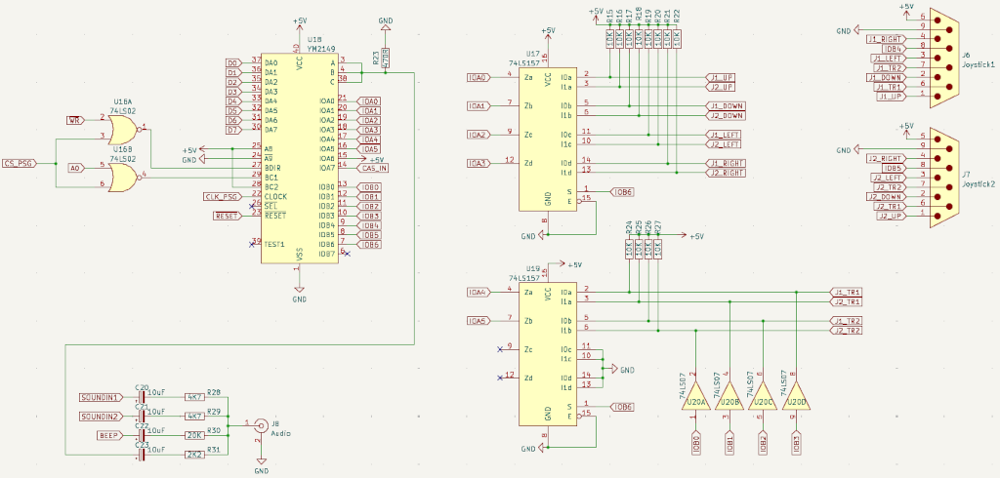](images/msx-jff-1.1-psg-circuit-diagram.png)

As can be seen on the depicted diagram, the JFF PSG circuit tries to mimic the standard MSX joystick circuit, but mixes up the output signals after the open-collector buffers.

[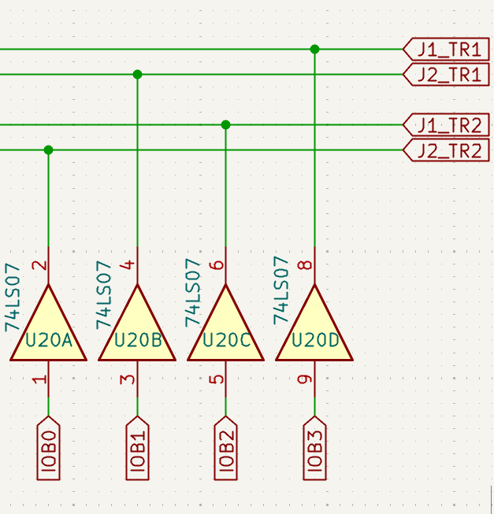](images/msx-jff-1.1-psg-circuit-diagram-open-collector-buffer-detail.png)

If we look closely at the connection of the trigger output signals to the open-collector buffer inputs and the connection of the open-collector buffer outputs to the joystick port signals we can see that:
- :x: the output of the open-collector buffer corresponding to signal IOB0 is incorrectly connected to joystick port 2 trigger B (J2_TR2)
- :x: the output of the open-collector buffer corresponding to signal IOB1 is incorrectly connected to joystick port 2 trigger A (J2_TR1)
- :x: the output of the open-collector buffer corresponding to signal IOB2 is incorrectly connected to joystick port 1 trigger B (J1_TR2)
- :x: the output of the open-collector buffer corresponding to signal IOB3 is incorrectly connected to joystick port 1 trigger A (J1_TR1)

# The fix

The circuit can be easily fixed by re-routing the affected signals to make them available at the right place.

[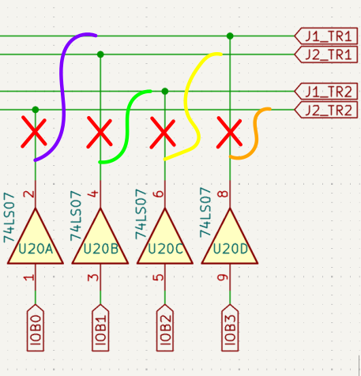](images/msx-jff-1.1-psg-fixed-circuit-diagram-open-collector-buffer-detail.png)

In the JFF 1.1 joystick circuit we have the following connections related to the triggers, taking into account the functional pinout of the [74LS07](https://www.ti.com/lit/ds/symlink/sn74ls07.pdf):
- input `Pin 1` of U20 (connected to IOB0) outputs to `Pin 2` of U20 (incorrectly connected to joystick port 2 trigger B, aka J2_TR2)
- input `Pin 3` of U20 (connected to IOB1) outputs to `Pin 4` of U20 (incorrectly connected to joystick port 2 trigger A, aka J2_TR1)
- input `Pin 5` of U20 (connected to IOB2) outputs to `Pin 6` of U20 (incorrectly connected to joystick port 1 trigger B, aka J1_TR2)
- input `Pin 9` of U20 (connected to IOB3) outputs to `Pin 8` of U20 (incorrectly connected to joystick port 1 trigger A, aka J1_TR1)

A clean and easy approach to fix the circuit is to use an interposer board at U20 (74LS07 open-collector buffer) that performs the needed re-mapping of signals.

[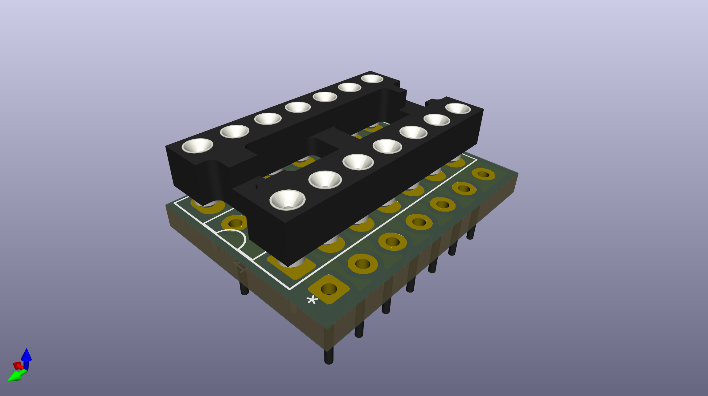](images/msx-jff-1.1-joyfix-board-overview-render.png)

So to re-route the signals to match the MSX standard joystick circuit we can map the U20-original signals to a new set of U20-interposed signals (where the 74LS07 will be actually connected), like this:
- Connect `Pin 2 of U20-interposed` (buffered output of Pin 1 of U20-interposed which connects to IOB0) to `Pin 8 of U20-original` (connected to joystick port 1 trigger A, aka J1_TR1), so that Pin 1 of U20-original (IOB0) outputs to Pin 8 of U20-original (joystick port 1 trigger A) ( `violet` path on the diagram)
- Connect `Pin 4 of U20-interposed` (buffered output of Pin 3 of U20-interposed which connects to IOB1) to `Pin 6 of U20-original` (connected to joystick port 1 trigger B, aka J1_TR2), so that Pin 3 of U20-original (IOB1) outputs to Pin 6 of U20-original (joystick port 1 trigger B) ( `green` path on the diagram)
- Connect `Pin 6 of U20-interposed` (buffered output of Pin 5 of U20-interposed which connects to IOB2) to `Pin 4 of U20-original` (connected to joystick port 2 trigger A, aka J2_TR1), so that Pin 5 of U20-original (IOB2) outputs to Pin 4 of U20-original (joystick port 2 trigger A) ( `yellow` path on the diagram)
- Connect `Pin 8 of U20-interposed` (buffered output of Pin 9 of U20-interposed which connects to IOB3) to `Pin 2 of U20-original` (connected to joystick port 2 trigger B, aka J2_TR2), so that Pin 9 of U20-original (IOB3) outputs to Pin 2 of U20-original (joystick port 2 trigger B) ( `orange` path on the diagram)
- Connect all other Pins of U20-interposed to the same Pins of U20-original (i.e Pin 1 to Pin 1, Pin 3 to Pin 3, etc.) ( solid `pink` paths on the diagram)

[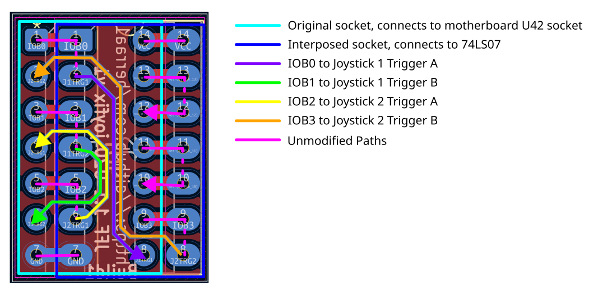](images/msx-jff-1.1-joyfix-connections.png)

Summarizing, after the re-routing we have fixed the issue:
- `Pin 1 of U20-original` (connected to IOB0) outputs to `Pin 8 of U20-original` (connected to joystick port 1 trigger A)
- `Pin 3 of U20-original` (connected to IOB1) outputs to `Pin 6 of U20-original` (connected to joystick port 1 trigger B)
- `Pin 5 of U20-original` (connected to IOB2) outputs to `Pin 4 of U20-original` (connected to joystick port 2 trigger A)
- `Pin 9 of U20-original` (connected to IOB3) outputs to `Pin 2 of U20-original` (connected to joystick port 2 trigger B)

And the complete trigger connection diagram matches now the original MSX joystick circuit diagram:
- :white_check_mark: the output at the open-collector buffer corresponding to signal IOB0 is connected to joystick port 1 trigger A (J1_TR1)
- :white_check_mark: the output at the open-collector buffer corresponding to signal IOB1 is connected to joystick port 1 trigger B (J1_TR2)
- :white_check_mark: the output at the open-collector buffer corresponding to signal IOB2 is connected to joystick port 2 trigger A (J2_TR1)
- :white_check_mark: the output at the open-collector buffer corresponding to signal IOB3 is connected to joystick port 2 trigger B (J2_TR2)

# Hardware

## [JFF-joyfix-board-v1-Build1](hardware/kicad/JFF-joyfix-board-v1-Build1/)

:white_check_mark: This board has been successfully built and tested.

[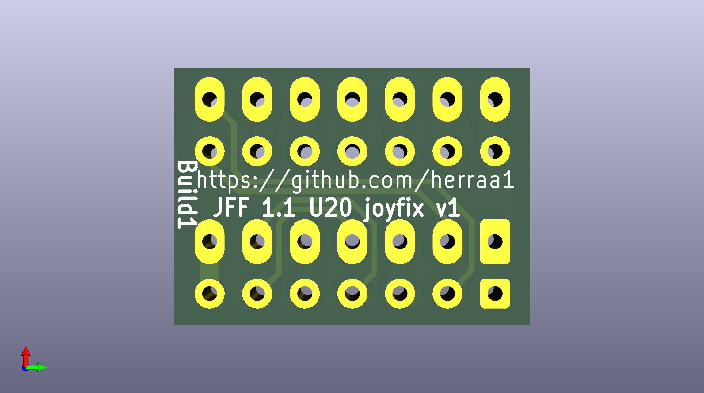](images/msx-jff-1.1-joyfix-board-front-render.png)

[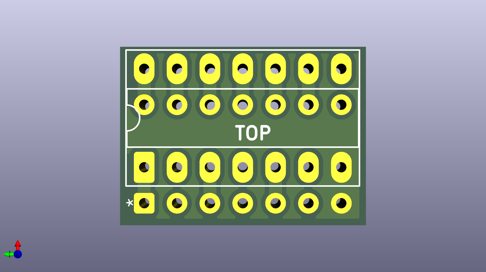](images/msx-jff-1.1-joyfix-board-back-render.png)

[Bill Of Materials (BoM)](https://html-preview.github.io/?url=https://raw.githubusercontent.com/herraa1/JFF-1.1-joyfix-board-v1/main/hardware/kicad/JFF-joyfix-board-v1-Build1/bom/ibom.html)

[Schematic and PCB](https://kicanvas.org/?github=https%3A%2F%2Fgithub.com%2Fherraa1%2FJFF-1.1-joyfix-board-v1%2Ftree%2Fmain%2Fhardware%2Fkicad%2FJFF-joyfix-board-v1-Build1)

## PCB Manufacturing tips

As the joyfix board is super small, some PCB manufacturers may make extra charges when building standalone prototypes or panelizing the boards using v-cuts.

One way to avoid the extra costs is panelizing the joyfix board using "mouse bites".

[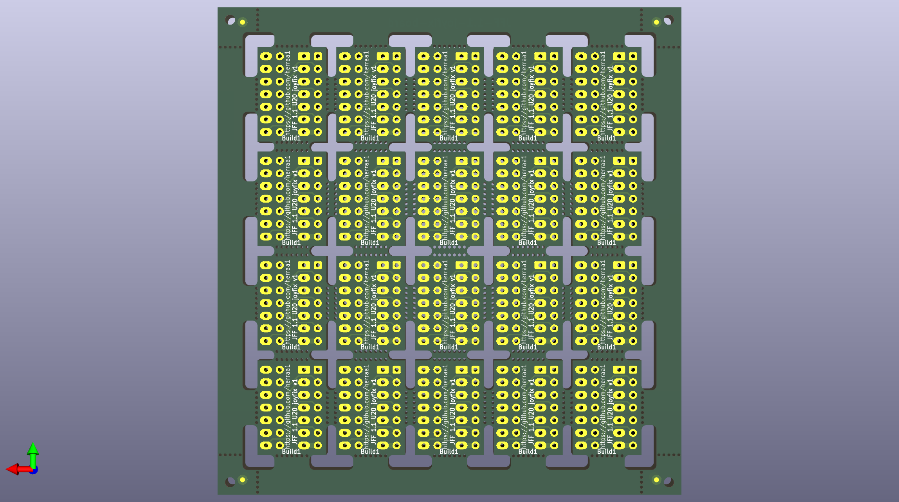](images/msx-jff-1.1-joyfix-panelizing-using-mouse-bites.png)

# Build instructions

Please, follow the [Omega 1.4 Joyfix Board Build Instructions](https://github.com/herraa1/omega-1.4-joyfix-board-v1?tab=readme-ov-file#build-instructions) to assemble the joyfix board. Both boards are assembled using the same procedure.

# Installation instructions

## Step by step instructions

1. Locate the U20 74LS07 IC chip on the JFF computer.

It is a DIP14 IC available near the joystick port 1.

[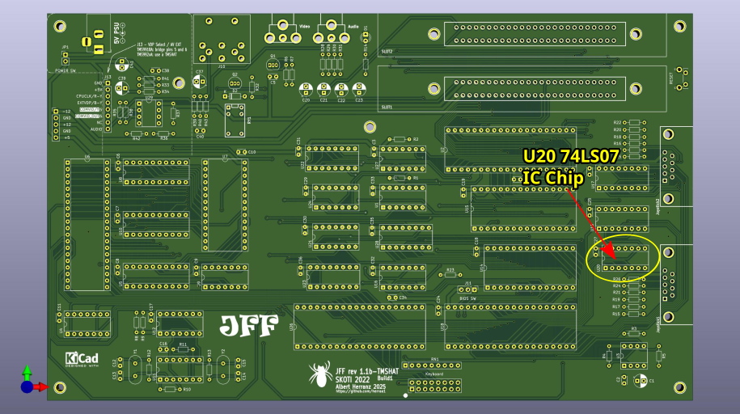](images/msx-jff-1.1-joyfix-install-locate-jff-U20.png)

2. Remove the 74LS07 chip from the U20 socket, insert it into the joyfix board socket, and then insert the joyfix board into the U20 socket.

Respect the IC notch markings when orienting both the 74LS07 and the joyfix board for insertion.

Make sure you properly align the joyfix board header pins to the U20 socket to make a good insertion without damaging the U20 socket.

[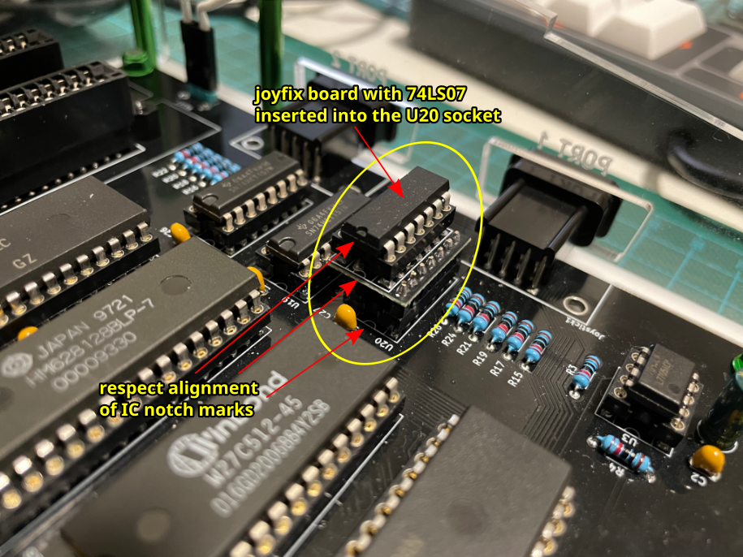](images/msx-jff-1.1-joyfix-install-joyfix-into-jff-U20.png)

# Validating the fix

Please, refer to the the Omega 1.4 Joyfix Board [Validating the fix](https://github.com/herraa1/omega-1.4-joyfix-board-v1?tab=readme-ov-file#validating-the-fix) section for additional details on how to validate the joyfix board using [MSXJIO](https://github.com/louthrax/MSXJIO) by @Louthrax.

## JFF 1.1 with the joyfix board

[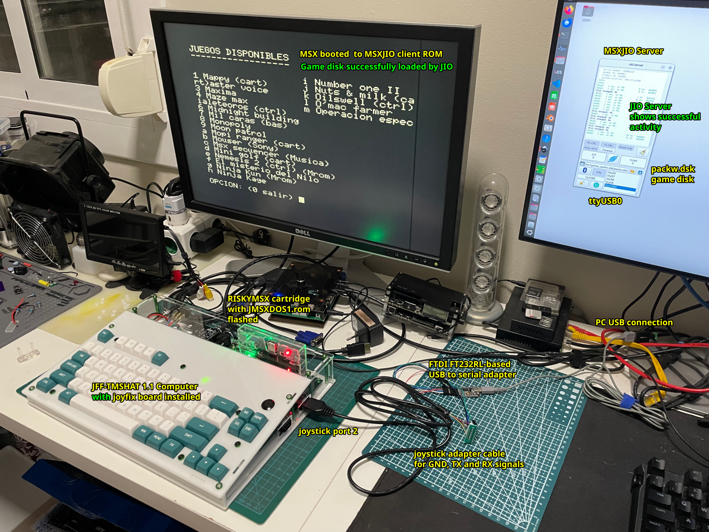](images/msx-jff-1.1-joyfix-test-fixed-jff.png)
